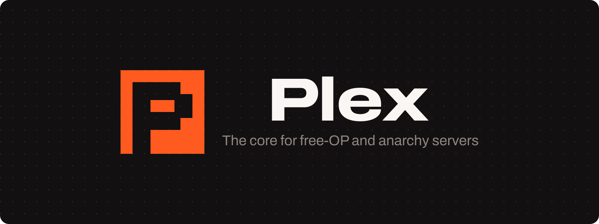

<p align="center"></p>

# Plex [](https://ci.plex.us.org/job/Plex/job/master/) [](https://github.com/plexusorg/Plex/blob/master/LICENSE.md) [](https://discord.plex.us.org)

Plex is the core plugin for free-OP and anarchy Minecraft servers. It changes how the entire server works, so that the
server fits a world where every player has broad powers.

Plex gives staff the tools to run such a server: punishments, player data, custom worlds, and protections. It works
with standard permission plugins through Vault and stores data in SQLite, MariaDB, or PostgreSQL. Optional Redis
support shares staff chat and ban updates between servers. Modules add more features without changes to the core
plugin. Plex is an independent project and a flexible alternative to TotalFreedomMod, not a rewrite of it.

## Features

- Permission-based freedom. Plex works with any Vault-compatible permissions plugin, such as LuckPerms, so you do not
  need a rank system.
- Player data storage in SQLite, MariaDB, or PostgreSQL.
- Optional Redis support to share staff chat and ban updates between servers.
- Optional WorldGuard integration for turnkey protected regions and reusable flag presets.
- Customizable messages, chat format, and custom worlds.
- A module system to add or remove features.

## Requirements

- Java 25.
- A [Paper](https://papermc.io) server on a supported Minecraft version. See the
  [version list](https://plex.us.org/docs/versions).
- A Vault-compatible permissions plugin is recommended.

## Download

Download a build from the [CI server](https://ci.plex.us.org/job/Plex/job/master/).

## Documentation

The documentation is at [plex.us.org](https://plex.us.org). It covers configuration, permissions, the modules, and how to
write your own module.

## Build from source

Plex uses Gradle. Build it with the wrapper.

```bash
./gradlew build
```

The JAR files are in `build/libs/`. For more detail, see the [compiling guide](https://plex.us.org/docs/compiling).

## Contributing

Read [CONTRIBUTING.md](CONTRIBUTING.md) before you open a pull request.

## License

Plex is licensed under the [GNU General Public License v3.0](LICENSE.md).
